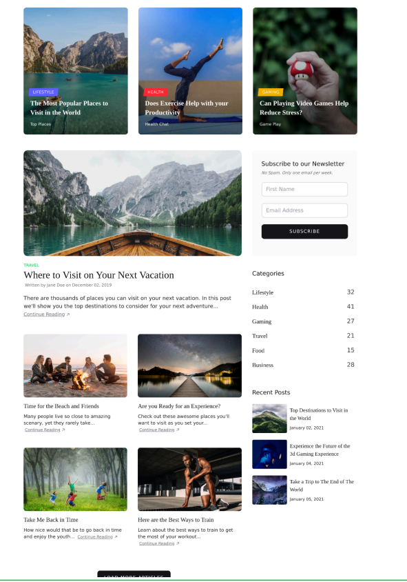

# Clon de Sitio Web

## Información del Proyecto

**Estudiante:** Dariel Josué Benavides Tapia  
**Universidad:** Universidad de Costa Rica  
**Curso:** Multimedios  
**Tarea:** 1 - Clon Web

## Sitio Clonado

Ejemplo de la tarea 1

## Descripción

Este proyecto es un clon del sitio web mostrado en el enunciado de la tarea 1, desarrollado como ejercicio de práctica en HTML5 y CSS3.

## Comparativa: Original vs Clon



_En la imagen superior se muestra el sitio original, y abajo el resultado del clon desarrollado._

## Tecnologías Utilizadas

- HTML5
- CSS3

## Estructura del Proyecto

```
tarea1-clon-web/
│
├── src/
│   ├── index.html
│   ├── assets/
│   │   └── images/
│   │       └── clon.jpg
│   └── css/
│       └── global.css
│
├── README.md
└── .gitignore
```

## Características Principales

- Estructura semántica HTML
- Estilos CSS personalizados

## Cómo Ver el Proyecto

1. Clona este repositorio
2. Abre `src/index.html` en tu navegador

---

_Desarrollado por Dariel_
